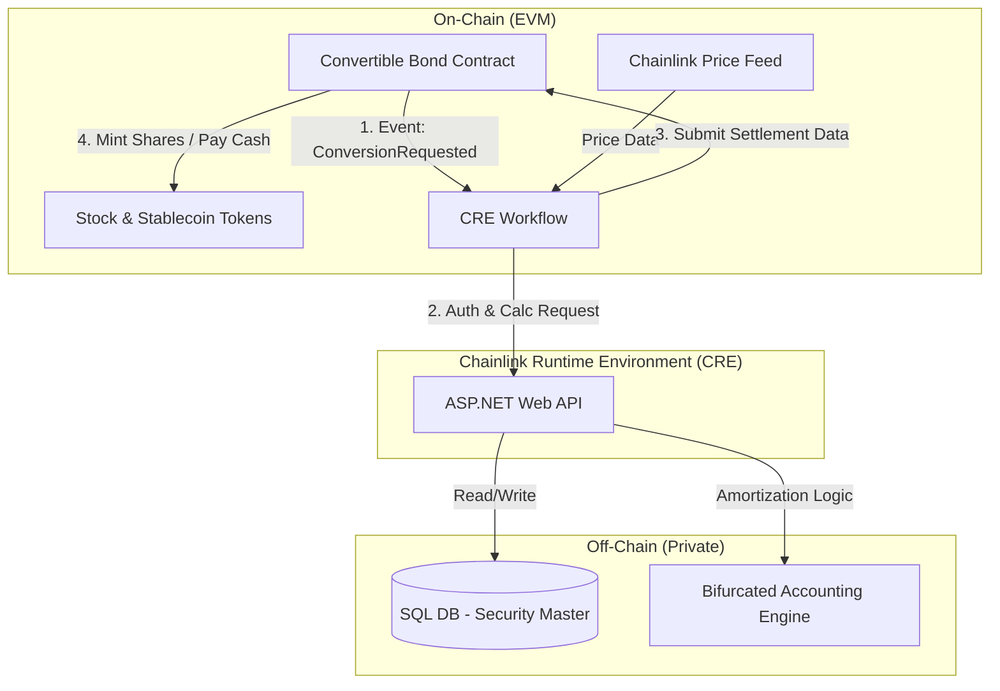

### **Architecture Overview**

This architecture leverages **Chainlink CRE (Runtime Environment)** as a decentralized orchestration layer that securely bridges your **C# ASP.NET Web API** (the financial "brain") and the **EVM Smart Contracts** (the settlement "muscle").

**Core Design Pattern:**

* **On-Chain (Smart Contracts):** Handles custody, token ownership, enforcement of rights, and settlement (moving assets).
* **Off-Chain (C# API):** Handles complex financial logic (GAAP accounting, amortization schedules), private data (journal entries), and legacy integration.
* **Chainlink CRE:** The "Trust Anchor." It executes **Workflows** (written in TypeScript/Go) that listen for on-chain events, fetch data from your C# API, validate it via consensus, and execute the resulting transactions on-chain.

---

### **1. Programmable Security Master**

*Defines the static and foundational attributes of the bond.*

* **On-Chain (Solidity):**
* Use a `struct BondTerms` in the smart contract to store immutable public data: `issuerId`, `isin`, `totalIssuance`, `faceValue`, `maturityDate`.
* **Standard:** Use **ERC-3643 (T-REX)** or **ERC-1400** as the base token standard. These support identity registries (KYC) which you already have.

* **Off-Chain (C# + EF Core):**
* **Database:** A `SecurityMaster` table stores the "Golden Record" including private metadata not needed on-chain (e.g., internal cost centers).

* **Chainlink CRE Workflow:**
* **Trigger:** C# API initiates an "Issue Bond" request.
* **Action:** CRE Workflow receives the bond details, validates the payload, and calls the `deployBond()` or `setTerms()` function on the Factory smart contract.
* **Result:** The contract address is returned to the C# API to link the off-chain record with the on-chain asset.

### **2. Convertible Parameter Engine**

*Manages dynamic metrics like Conversion Ratio and Price.*

* **On-Chain:**
* Variables: `conversionRatio` (scaled integer), `conversionPrice`.
* Function: `updateConversionMetrics(uint256 newRatio, uint256 newPrice)`. Access limited to the **CRE Forwarder** address.

* **Off-Chain:**
* **Logic:** The C# engine calculates adjustments (e.g., for stock splits or dividends) which affect the ratio.

* **Chainlink CRE Workflow:**
* **Trigger:** C# API detects a corporate action (e.g., Stock Split).
* **Action:** A CRE Workflow is triggered to push the new `conversionRatio` to the smart contract.
* **Verification:** The CRE nodes can optionally verify the corporate action data from a secondary public source (e.g., Bloomberg/Refinitiv adapter) before updating the contract.

### **3. Bifurcated Accounting Module (ASC 470-20)**

*Separates Liability (Debt) and Equity components.*

* **Architecture Note:** This is **strictly off-chain logic**. The blockchain does not care about GAAP accounting, but your C# API must track it to generate financial statements.
* **Off-Chain (C# Logic):**
1. **Input:** Total Proceeds ($10M), Coupon Rate (2%), Market Rate for non-convertible debt (5%).
2. **Calculation (Method: With-and-Without):**
* *Fair Value of Liability* = PV of Principal + PV of Coupons (discounted at 5%).
* *Equity Component* = Total Proceeds - Fair Value of Liability.

3. **Storage:** Store `LiabilityCarryingValue` and `EquityReserve` in the SQL database via Entity Framework.

### **4. Automated Discount Amortization**

*Calculates interest expense using the effective interest method.*

* **Off-Chain (C# + Quartz.NET/Hangfire):**
* **Schedule:** A background job runs monthly.
* **Logic:** `InterestExpense = BeginningLiabilityBalance * EffectiveInterestRate`.
* **Journal Entry:** Debit Interest Expense, Credit Discount on Bonds Payable (increasing the Liability Carrying Value).

* **On-Chain Relationship:**
* None directly. However, you can optionally push the "Net Carrying Value" to a view-only variable on the smart contract if investors require transparency into the *book value* of the debt.

### **5. Programmable Coupon Payments**

*Automated push payments to token holders.*

* **On-Chain:**
* **Token Snapshot:** The contract must support `balanceOfAt(blockNumber)` (Checkpointing) to identify holders on the Record Date.
* **Payment Function:** `distributeCoupon(address token, uint256 totalAmount)`.

* **Chainlink CRE Workflow (The "Keeper"):**
* **Trigger:** A **Time-based Trigger** (Cron) in CRE fires on the coupon date.
* **Action:**
1. CRE calls the Smart Contract to snapshot balances (Record Date).
2. CRE calls your C# API `GetCouponDetails()` to confirm the rate and authorization.
3. CRE initiates the transaction to pull Stablecoins (USDC) from the Issuer Wallet and distribute them to the `Snapshot` holders.

* **Benefit:** This bypasses the need for a paying agent; the code is the agent.

### **6. Conversion & Special Event Management**

#### **A. Contingent Trigger Monitor (Market Price Trigger)**

* **Chainlink CRE (Data Feeds & Automation):**
* **Monitor:** A CRE Workflow runs daily to check the **Chainlink Price Feed** for the underlying stock.
* **Logic:** `If (StockPrice > ConversionPrice * 1.30) for (20 of 30 trading days)`.
* **Execution:** If true, the CRE Workflow calls `setConvertibility(true)` on the smart contract. This "unlocks" the `convert()` function for investors.

#### **B. Settlement Logic (Physical, Cash, Net Share)**

This is the most complex interaction requiring a **Request-Response** pattern.

1. **Investor Action:** Calls `requestConversion(amount)` on the Smart Contract.
2. **Event:** Contract emits `ConversionRequested(requestId, investor, amount)`.
3. **Chainlink CRE Workflow:**
* Listens for `ConversionRequested`.
* **Call C# API:** Sends payload to `POST /api/settlement/calculate`.
* **C# Processing:**
* Determines Settlement Method (e.g., Net Share).
* Calculates: `CashAmount = Principal`, `SharesAmount = (ConversionValue - Principal) / StockPrice`.

* **Response:** C# returns `{ cash: 1000, shares: 50 }`.

4. **On-Chain Execution:**
* CRE invokes `settleConversion(requestId, cashAmount, shareAmount)`.
* Contract: Burns Bond Tokens -> Transfers Stablecoin (Cash) -> Mints/Transfers Stock Tokens.

#### **C. Induced Conversion (Make-Whole)**

* **Off-Chain:** The Issuer decides to offer a temporary premium.
* **C# API:** Admin sets a "Make-Whole Period" and "Additional Shares" logic in the database.
* **CRE Sync:** Updates the smart contract's `makeWholeTable` (mapping of time remaining -> additional shares).
* **Execution:** When `settleConversion` runs (as above), the Smart Contract adds the `makeWholeShares` to the payout automatically based on the table.

### **7. Liability Derecognition**

*Automated accounting cleanup.*

* **Trigger:** The `ConversionSettled` event on the blockchain.
* **Chainlink CRE -> C# API:**
* The CRE Workflow detects the successful settlement transaction hash.
* It calls `POST /api/accounting/derecognize` with the transaction proof.

* **C# Logic:**
* Debit `Bonds Payable` (Carrying Amount).
* Debit `Equity - Conversion Option` (if applicable).
* Credit `Common Stock` (Par Value).
* Credit `APIC` (Plug).
* **Result:** Real-time synchronization between the blockchain state (tokens burned) and the General Ledger (liability removed).

### **Summary Architecture Diagram (Text Version)**

### **Relevance of Selected Video**

The video below explains the core concept of the **Chainlink Runtime Environment (CRE)** and how its "Workflows" replace disjointed scripts. It specifically visualizes how to connect off-chain APIs to on-chain contracts for complex financial workflows (like your settlement logic) in a single, unified architecture.

... [Chainlink Runtime Environment Architecture Explained](https://www.google.com/search?q=https://www.youtube.com/watch%3Fv%3DJ3gO3PqtCJI) ...

This video is relevant because it provides a visual and conceptual understanding of how CRE orchestrates the exact off-chain to on-chain "glue" code your convertible bond platform relies on for synchronization.